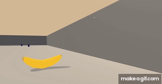

# reinforcement_learning_navigation
Deep Q-Network to train an agent to pick to navigate a space and pick up yellow bananas



### Environment

Unity Machine Learning Agents (ML-Agents) is an open-source Unity plugin that enables games and simulations to serve as environments for training intelligent agents. 

The agent's goal is to collect yellow bananas, which have a reward of +1, and avoid blue bananas, which have a reward of -1.

The state space has 37 dimensions and contains the agent's velocity, along with ray-based perception of objects around agent's forward direction. Given this information, the agent has to learn how to best select actions. Four discrete actions are available, corresponding to:

    0 - move forward.
    1 - move backward.
    2 - turn left.
    3 - turn right.

The task is episodic. To solve the environment, the agent should achieve an average score of +13 over 100 consecutive episodes.


### Set Up

To run this project on your local machine, clone this repository, change directory into the python file and install the dependencies. I'd recommend taking these steps withing a conda [environment](https://conda.io/docs/user-guide/tasks/manage-environments.html#creating-an-environment-with-commands).

```
git clone https://github.com/rastringer/reinforcement_learning_navigation.git
cd python 
pip install .
```

Then run the Navigation.ipynb notebook.

```
jupyter notebook Navigation.ipynb
```


### Approach

The model.py file comprises python implementations of the deep Q-network and duelling Q-network algorithms, approaches learned from this Deepmind [paper](https://storage.googleapis.com/deepmind-media/dqn/DQNNaturePaper.pdf).
Watch this [video](https://youtu.be/_lqlJ6umfBE) to see the agent in action.
